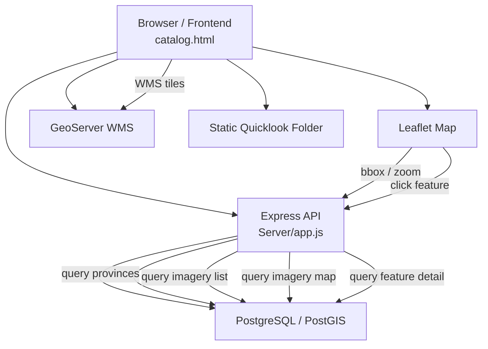

# Dokumentasi Sistem Katalog Citra Satelit

## 1. Gambaran Umum Sistem

Sistem ini adalah aplikasi katalog citra satelit berbasis web yang menampilkan peta interaktif dan daftar katalog citra. Tujuan sistem adalah membantu pengguna mencari, memfilter, dan melihat metadata serta preview citra satelit pada area tertentu.

### Tujuan Sistem
- Menyediakan antarmuka pencarian dan filter citra satelit.
- Menampilkan hasil sebagai daftar katalog dan tampilan peta.
- Menyajikan detail citra serta quicklook saat fitur dipilih.

### Fungsi Utama Sistem
- menampilkan peta Leaflet dengan base map OpenStreetMap.
- memfilter hasil berdasarkan katalog, provinsi, satelit, dan kata kunci.
- memanggil API backend untuk data katalog dan data peta.
- menampilkan polygon fitur dan overlay WMS dari GeoServer.
- menampilkan panel detail serta preview quicklook.
- scroll infinite pagination pada daftar katalog.

### Teknologi yang Digunakan
- Frontend: HTML/CSS/JavaScript murni di `catalog.html`
- Peta: Leaflet
- Backend: Node.js + Express
- Database: PostgreSQL + PostGIS
- GIS Service: GeoServer WMS
- Static preview image: Express static serve
- Dependensi backend: `cors`, `dotenv`, `express`, `pg`, `node-fecth`

### Arsitektur Umum
- Frontend `catalog.html` mengontrol UI, state aplikasi, dan permintaan data.
- Backend `Server/app.js` menyediakan REST API untuk provinsi, katalog citra, peta, detail fitur, dan health-check.
- Database PostgreSQL/PostGIS menyimpan tabel citra (`imagery`, `lasac_catalog`) dan area provinsi (`aoi_provinsi`).
- GeoServer menyediakan layer WMS yang ditampilkan di peta Leaflet.

---

## 2. Struktur Folder Project

### Root
- `catalog.html`
  - Halaman frontend utama.
  - Menyediakan UI sidebar, filter, daftar katalog, peta, dan panel detail.
- `.env`
  - Konfigurasi database lokal: `DB_USER`, `DB_HOST`, `DB_NAME`, `DB_PASSWORD`, `DB_PORT`.
  - Perlu diaktifkan di backend jika ingin menggunakan `dotenv`.

### `Server/`
- `app.js`
  - Server Express utama.
  - Membuat koneksi PostgreSQL, CORS, routing API, validasi input, query SQL, dan pengembalian data.
- `db.js`
  - Menyediakan konfigurasi `Pool` PostgreSQL dengan `pg`.
- `package.json`
  - Metadata backend dan dependensi Node.js.

### `node_modules`
- Folder dependency Node.js yang dihasilkan `npm install`.
- Menyimpan library seperti `express`, `pg`, dan `cors`.

---

## 3. Alur Sistem End-to-End

1. User membuka website `catalog.html` di browser.
2. Browser memuat HTML, CSS, Leaflet, dan JavaScript internal.
3. Frontend memanggil `loadProvinceList()` untuk mendapatkan daftar provinsi dari `/api/provinces`.
4. Frontend memanggil `loadData()` untuk memuat data peta dan daftar katalog.
5. `loadData()` menentukan apakah akan menggunakan filter bbox berdasarkan zoom peta.
6. Frontend memanggil API backend:
   - `/api/imagery/map` untuk data fitur peta.
   - `/api/imagery` untuk daftar katalog dengan paging.
7. Backend menerima parameter filter, membangun SQL, dan query PostgreSQL/PostGIS.
8. Backend mengembalikan GeoJSON fitur untuk peta dan `Feature` list untuk daftar.
9. Frontend merender polygon di Leaflet lewat `renderMap()`.
10. Frontend membangun daftar item dengan `buildList()`.
11. Jika user memilih item, frontend memanggil `/api/imagery/:gid` untuk detail fitur.
12. Backend mengembalikan detail fitur lengkap termasuk geometri dan quicklook.
13. Frontend menampilkan panel detail dan `L.imageOverlay` untuk quicklook.
14. Untuk WMS overlay, frontend memanggil GeoServer lewat `buildWMSLayer()`.
15. User dapat memperbesar/pindahkan peta, yang memicu `moveend` dan reload data jika diperlukan.

---

## 4. Penjelasan Frontend

### Fungsi Utama `catalog.html`
- menampilkan UI katalog citra satelit.
- memanggil API backend untuk daftar provinsi, data peta, dan detail fitur.
- mengelola state filter, pagination, dan tampilan peta.
- merender polygon dan daftar katalog.

### Komponen UI
- Sidebar kiri berisi logo, pencarian, filter katalog, filter provinsi, filter satelit, counter hasil, dan daftar item.
- Map area menggunakan Leaflet.
- Panel detail kanan menampilkan metadata citra.

### Sidebar / Filter / List Katalog
- `#search` untuk pencarian nama layer.
- `#catalog-filter` pilih antara `STARVISION` dan `LASAC`.
- `#province-filter` pilih provinsi dari API.
- `#satellite-filter` tombol segmented untuk memilih satelit.
- `#list-wrap` memuat daftar item hasil.

### Leaflet Map
- Dibuat dengan `L.map("map")` dan `L.tileLayer` OpenStreetMap.
- Pane khusus `quicklookPane` untuk image overlay.
- `L.geoJSON` digunakan untuk menampilkan polygon fitur.
- Poligon diberi event `click`, `mouseover`, dan `mouseout`.

### Event `click`, `zoom`, `moveend`
- Klik polygon memanggil `selectFeature()`.
- Klik item daftar memanggil `zoomToFeatureAndSelect()`.
- `map.on("moveend")` dengan debounce memicu `loadData()` saat peta berhenti bergerak.
- Klik di area peta kosong menutup panel detail.

### Pagination
- Implementasi infinite scroll di `#list-wrap`.
- Saat scroll mendekati bawah, request halaman berikutnya ke `/api/imagery`.
- `STATE.listOffset` dan `STATE.limit` digunakan untuk menghitung page.
- `STATE.hasMore` mengatur apakah masih ada data selanjutnya.

### Dynamic Rendering Data
- `renderMap()` menampilkan kembali semua fitur peta.
- `buildList()` menambahkan item list ke DOM.
- `highlightText()` memberi sorotan teks keyword.
- `showPanel()` menampilkan panel metadata.

---

## 5. Penjelasan Backend

### Fungsi Express Server
- Menjalankan API di port `3000`.
- Menggunakan middleware logging request dan CORS.
- Membaca database PostgreSQL melalui `pg.Pool`.
- Menyediakan endpoint API utama untuk data frontend.

### Endpoint API
- `GET /api/provinces`
  - Mengambil semua provinsi dari tabel `aoi_provinsi`.
- `GET /api/province-geom`
  - Mengambil geometri provinsi sebagai GeoJSON.
- `GET /api/imagery`
  - Mengambil daftar citra dengan paging dan filter.
- `GET /api/imagery/map`
  - Mengambil fitur peta berdasarkan bbox, zoom, dan filter lain.
- `GET /api/imagery/:gid`
  - Mengambil detail feature berdasarkan ID.
- `GET /api/health`
  - Health-check database dan service.

### Query PostgreSQL/PostGIS
- `getCatalogConfig()` memilih konfigurasi query untuk `STARVISION` atau `LASAC`.
- Memakai `ST_AsGeoJSON(i.geom)` untuk mengekspor geometri.
- Query memanfaatkan `ST_MakeEnvelope(..., 4326)` untuk bbox filter.
- Filter provinsi menggunakan `ST_Intersects(i.geom, a.wkb_geometry)`.
- `ORDER BY` berdasarkan tanggal akuisisi atau field waktu.

### Pengolahan GeoJSON
- Response `/api/imagery/map` dan detail fitur mereturn objek GeoJSON.
- `FeatureCollection` dibangun di backend untuk peta.
- `geometry` diambil dari hasil `ST_AsGeoJSON()`.

### Filtering Data
- Satellite filter: `i.satellite ILIKE '...'`
- Keyword filter: `i.layer` atau `i.filename` ILIKE `%keyword%`
- Province filter: `EXISTS (...) ST_Intersects(...)`
- BBox filter: `i.geom && ST_MakeEnvelope(...)`
- Pagination: `LIMIT ... OFFSET ...`
- Dynamic limit berdasarkan zoom peta di endpoint map.

### Error Handling
- `try/catch` di setiap endpoint.
- Mengembalikan status `500` dan pesan error saat terjadi exception.
- Validasi input:
  - `sanitizeCatalog()` untuk validasi katalog.
  - `sanitizeSatellite()` untuk validasi satelit.
  - `parseBBox()` untuk validasi bbox.
  - validasi `gid` angka positif di detail endpoint.
  - validasi nama provinsi tidak kosong.

---

## 6. Penjelasan Integrasi GIS

### Cara WMS/WFS Digunakan
- Sistem menggunakan WMS, bukan WFS.
- `buildWMSLayer()` membuat tile layer WMS dari GeoServer.
- GeoServer diakses melalui URL `http://localhost:8082/geoserver/.../wms`.

### Integrasi GeoServer
- Layer WMS diambil dari workspace `starvision`.
- Layer yang dipanggil:
  - `starvision:shp_merge` untuk `STARVISION`
  - `starvision:lasac_catalog` untuk `LASAC`
- Filter WMS diterapkan melalui `CQL_FILTER`.

### Cara Layer Dipanggil
- `L.tileLayer.wms(...)` digunakan untuk membuat WMS layer.
- `CQL_FILTER` dibangun dari kondisi satelit dan keyword.
- Layer hanya ditambahkan jika `province` adalah `ALL`.

### Coordinate System
- Semua query dan layer menggunakan EPSG:4326.
- BBox backend dibuat dengan `ST_MakeEnvelope(..., 4326)`.
- Leaflet menggunakan koordinat latitude/longitude.

### Bounding Box
- Frontend membangun format `west,south,east,north` dari `map.getBounds()`.
- `parseBBox()` memvalidasi keempat nilai.
- BBox digunakan untuk memperkecil hasil data ketika zoom cukup tinggi.

### Spatial Filtering
- Frontend memutuskan apakah menggunakan bbox ketika zoom >= 6.
- Backend menerapkan filter `&& ST_MakeEnvelope(...)` untuk efisiensi.
- Provinsi menggunakan filter spasial `ST_Intersects` dengan geometri AOI.

---

## 7. Alur Data

1. Frontend request data ke API.
2. API backend memproses filter dan paging.
3. Database PostgreSQL/PostGIS mengembalikan row citra dan geometri.
4. Backend menyusun GeoJSON dan feature list.
5. Frontend merender polygon di Leaflet dan daftar item.
6. GeoServer WMS memberikan layer tile tambahan yang ditampilkan di peta.
7. Quicklook image disajikan dari folder static server Express.

---

## 8. State Management

State utama dikelola di `catalog.html` pada object `STATE`:
- `province`: provinsi terpilih.
- `satellite`: filter satelit.
- `keyword`: teks pencarian.
- `listOffset`: posisi offset pagination.
- `limit`: jumlah item per halaman.
- `isLoading`: status loading API.
- `hasMore`: apakah masih ada lebih banyak data.
- `selectedLayer`: layer peta yang sedang aktif.
- `loadedIds`: mencegah duplikat item daftar.
- `isSelectingFeature`: flag untuk mencegah reload peta saat memilih fitur.
- `useBBoxFilter`: menentukan apakah filter bbox aktif.

### Penggunaan state
- Filter baru menyebabkan `STATE.cache.clear()` dan `loadData()`.
- `STATE.listOffset` direset saat `loadData()` baru.
- `STATE.hasMore` diupdate setelah response list.
- `STATE.limit` ditetapkan oleh `getDynamicLimit()` berdasarkan zoom.

---

## 9. Penjelasan Fungsi Penting

### `buildWMSLayer()`
- Membangun WMS layer GeoServer sesuai filter.
- Menggunakan `CQL_FILTER` untuk satelit dan kata kunci.
- Dipanggil saat peta pertama kali dimuat dan ketika filter berubah.

### `zoomToProvince(name)`
- Memanggil API `/api/province-geom`.
- Mengembalikan peta ke seluruh Indonesia jika `ALL`.
- Melakukan `map.fitBounds(...)` pada geometri provinsi.

### `renderMap(features)`
- Menampilkan fitur GeoJSON ke peta Leaflet.
- Membuat `layerMap[id]` untuk setiap feature.
- Menambahkan event click/hover ke setiap polygon.

### `loadData()`
- Fungsi utama refresh data.
- Memutus request lama jika ada.
- Menentukan `bbox`, `filterKey`, dan `cacheKey`.
- Memanggil API map dan list.
- Menyimpan hasil ke cache lokal.

### `zoomToFeatureAndSelect(f, id)`
- Menggunakan data feature sudah ada jika tersedia.
- Jika belum, memanggil `/api/imagery/:gid`.
- Merender ulang peta hanya dengan fitur tersebut.
- Memanggil `selectFeature()` setelah render.

### `selectFeature(f, layer)`
- Menyorot layer terpilih.
- Mengubah style polygon.
- Menampilkan panel detail.
- Memanggil `showQuicklookOverlay()` setelah `moveend`.

### `updateWMSIfNeeded()`
- Menghapus layer WMS lama.
- Membangun ulang WMS layer dengan kondisi filter terbaru.
- Menambahkan layer ke peta.
- Memastikan geojson selalu berada di depan.

---

## 10. Kendala dan Potensi Masalah

### Bottleneck Performa
- `renderMap()` me-refresh seluruh layer setiap kali load ulang.
- List dan peta di-request paralel bisa menyebabkan penggunaan resource tinggi.

### Duplicate Request
- `map.on("moveend")` memicu reload data dan dapat berpotensi duplikat saat `pendingUserAction` tidak di-reset sempurna.
- Request `map` dan `list` dibuat paralel, sehingga server menerima dua query sekaligus.

### Over-render Polygon
- Semua polygon dirender sekaligus tanpa clustering atau generalisasi geometri.
- Data besar pada zoom rendah dapat memperlambat Leaflet.

### Sinkronisasi Map dan List
- Sinkronisasi dilakukan melalui event handler `click` dan `highlightList()` saja.
- Tidak ada satu fungsi terpusat untuk menjaga state list dan peta selaras.

### Zoom Terlalu Dekat
- `useBBoxFilter` hanya aktif sejak zoom >= 6.
- Pada zoom rendah, query global masih bisa memuat banyak data.

### Query Lambat
- Query `ST_Intersects` dan `ST_MakeEnvelope` memerlukan index spasial.
- Jika index belum terpasang, response dapat lambat.

### Memory Leak Event Listener
- Event layer baru dibuat setiap kali `renderMap()` dipanggil.
- Meskipun `geoLayer.clearLayers()` membersihkan layer, listener ditambahkan ulang terus-menerus.

---

## 11. Optimasi yang Bisa Dilakukan

### Frontend
- Tambahkan virtual scrolling untuk daftar panjang.
- Gunakan clustering atau simplifikasi geometri di Leaflet.
- Perbaiki caching API secara konsisten.
- Gunakan `dotenv` di backend untuk konfigurasi environment.

### Backend / Database
- Pastikan index spasial PostGIS pada kolom `geom` dan `wkb_geometry`.
- Optimalkan query filter provinsi dan bbox.
- Batasi `limit` default dan maksimal untuk mencegah beban berlebih.
- Gunakan cache server jika data sering di-request.

### GIS / GeoServer
- Aktifkan GeoWebCache tile caching untuk layer WMS.
- Batasi WMS overlay pada zoom rendah.

### Umum
- Hilangkan dependensi `node-fecth` jika tidak diperlukan.
- Gunakan `dotenv.config()` untuk membaca `.env`.
- Tambahkan monitoring health-check dan log lebih lengkap.

---

## 12. Diagram Alur Sistem

---

## 13. Kesimpulan Sistem

Sistem ini menggabungkan frontend Leaflet dengan backend Express/PostgreSQL dan GeoServer WMS untuk katalog citra satelit. Frontend mengelola filter dan state, backend menjalankan query spasial, dan GeoServer menyediakan layer WMS tambahan. Interaksi map-list dijaga melalui event klik, scroll pagination, dan highlight fitur.
